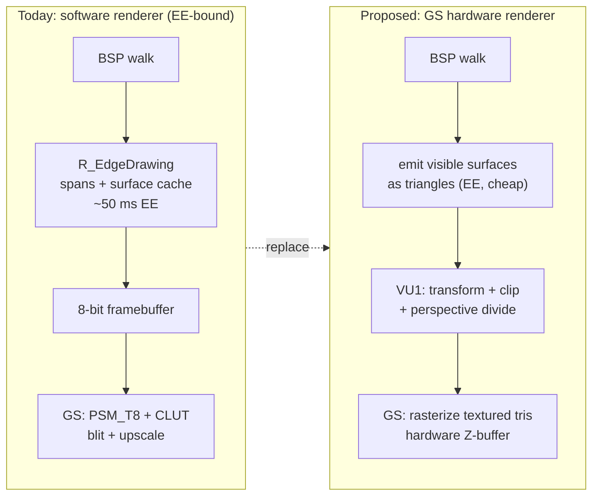
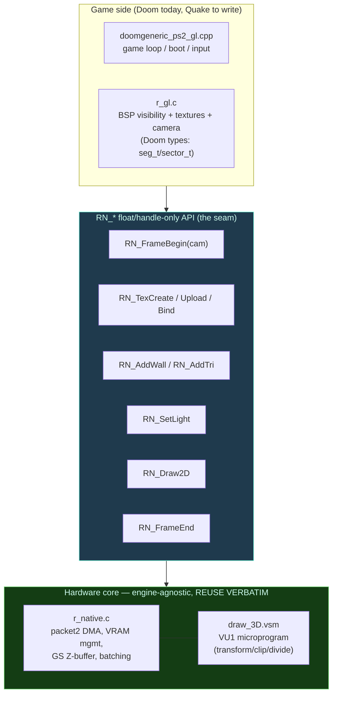
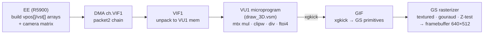
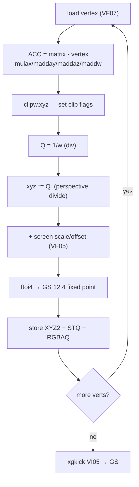
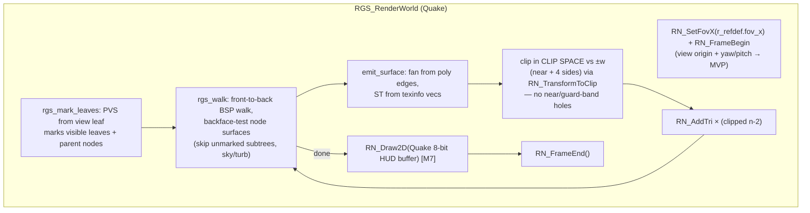
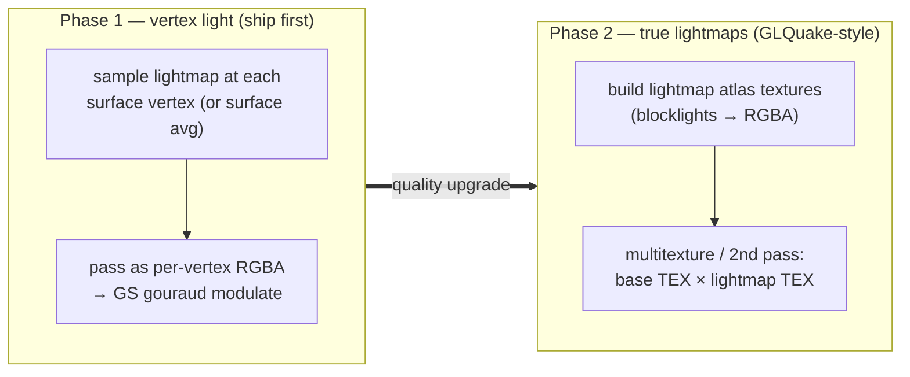
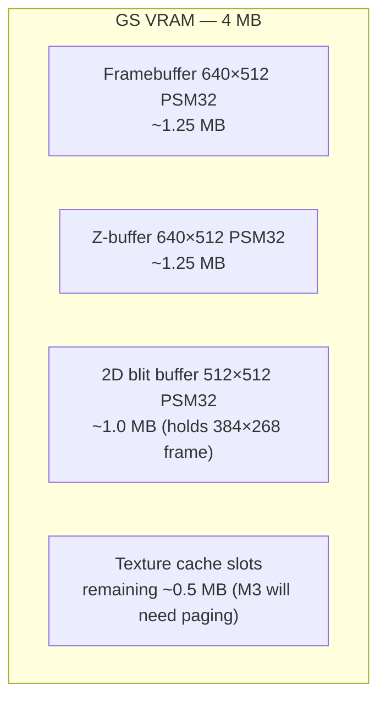
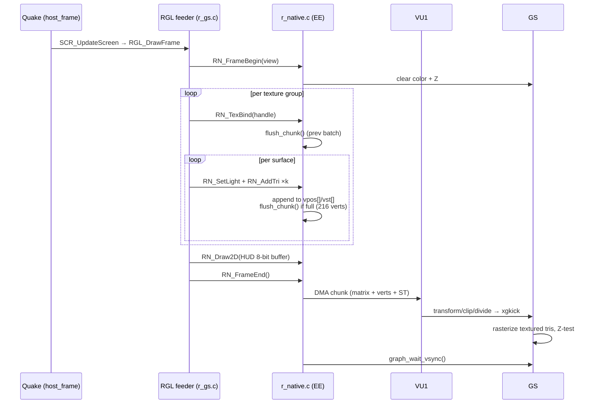

# GS Hardware Renderer — Design & Port Plan

**Status:** in progress — **M1, M2a, M2b, M2c, M2d done** (world geometry renders
on the GS, PVS + backface culled, clip-space clipped against the view frustum so
near/guard-band holes are gone). Built as a **separate ELF** (`quake-hw.elf`); the
software renderer (`quake.elf`) still ships as the default. See §10 for the
roadmap and §13 for build/run.
**Goal:** move Quake's 3D world rasterization off the EE software renderer and
onto the **Graphics Synthesizer (GS)**, driven by a **VU1 + DMA** geometry
pipeline — running native 640×512, hardware-Z, textured, at a stable framerate.

> TL;DR — The PS2-correct path (VU1 transforms vertices → GIF → GS rasterizes
> textured triangles with a hardware Z-buffer) already exists, working and
> debugged, in our sibling **doomgeneric** PS2 port (`r_native.c` +
> `draw_3D.vsm`). That core is **engine-agnostic**. Porting to Quake means
> reusing it verbatim and writing a Quake-specific *feeder* that walks the BSP
> and emits visible surfaces as triangles — plus lightmaps, the one genuinely
> new piece.

---

## 1. Why — the software renderer is at the EE's ceiling

Measured on the boot demo (PCSX2), internal res 384×268, full-res 3D. Per-phase
timing of `V_RenderView` during the heavy ~12 fps stretch:

| metric | light scene | heavy dip |
|---|---:|---:|
| frame total | ~47 ms (21 fps) | ~80–92 ms (11–13 fps) |
| **world raster** (`V_RenderView`) | ~31 ms | ~55–80 ms |
| └ `R_EdgeDrawing` (spans + surface cache) | ~25 ms | **42–53 ms** |
| └ `R_DrawEntitiesOnList` (alias models) | ~3 ms | 8–15 ms |
| └ `R_DrawViewModel` | ~2 ms | ~2 ms |
| └ `R_DrawParticles` | ~0 ms | 1–9 ms |
| GS present (upload + blit) | ~10 ms | ~10 ms |
| everything else (server/IO/sound) | ~3–13 ms | ~3–13 ms |

Three independent results converged:

1. **Resolution levers don't fix the dips** — the same teens-fps appears at 320,
   384, `r_3dscale` 1/2/3. The bottleneck isn't only fill rate.
2. **The cheap C win moved nothing** — hoisting the per-pixel aliasing reloads
   (`vid.colormap`, `cachewidth`) out of the inner loops changed `edge` by <2 ms.
   The loops are **memory-latency-bound** (the 64 KB colormap + texture/lightmap
   gathers thrash the EE's 8 KB data cache), which assembly cannot fix.
3. **File IO is not the stall** — `frame − present ≈ 3–13 ms`, i.e. server +
   disc IO + sound combined is negligible. `fio` → `fileXio` would not help here.

Every external reference agrees: the fast MIPS Quake/Doom ports (PSP, N64) and
the PS2 Q2 port reach speed via the **GPU**, not assembly-tuned software.



---

## 2. The reference — doomgeneric's native VU1 + DMA renderer

Source: `/home/arawn/src/doomgeneric/ps2/` (build with `./build.sh gl`).
Selected by `GL_VIDEO=1`; objects `doomgeneric_ps2_gl.o r_gl.o r_native.o
draw_3D.o`.

The design is split into a **game-agnostic hardware core** and a **thin
game-specific feeder** — exactly the seam we exploit for Quake.



Key properties of the core (`r_native.c`):

- **No Doom headers.** PS2SDK's `draw.h` defines `vertex_t`/`line_t`, which
  clash with Doom's `r_defs.h`; the two halves are deliberately separated and
  only talk through the float/handle `RN_*` API. This is *why* it ports cleanly.
- **Hardware Z-buffer** (`GS_ZBUF_32`, `ZTEST_METHOD_GREATER_EQUAL`) does
  occlusion — no software depth sort, no painter's ordering needed.
- **VU1 microprogram** does transform + `clipw` + perspective `div` + `ftoi4`
  + `xgkick`; double-buffered VU input (`packet2_utils_vu_add_double_buffer(8,
  496)` → 496 qw per buffer).
- **Geometry is chunked** (`CHUNK_VERTS = 216`, i.e. 36 walls/chunk) so a chunk's
  header + positions + ST fits the 496 qw VU input buffer; `flush_chunk()` DMAs
  one chunk and ping-pongs `geom_pkt[0]/[1]`.
- **Textures**: each is a fixed 64×64 PSM32 tile (`TEX_DIM`), uploaded **once**
  to its own VRAM slot (`RN_TexCreate`/`RN_TexUpload`), and walls are **batched
  per texture** (bind once, draw all) — `RN_TexBind` flushes the previous batch.
- **`ps2gl` was removed** ("its baked-in geometry buffer overflowed in heavy
  rooms; we now own the DMA packets") — a lesson already paid for.

> The hard, blind-test-risky parts — VU1 microcode, DMA packet management, GS
> Z-buffer bring-up, VRAM texture cache — are **already written and debugged**.
> That was the entire risk of "write a GS renderer." It's retired.

---

## 3. PS2 hardware pipeline primer

The path each frame's geometry travels. Quake (on the EE) only produces the
float vertex/ST arrays; the VIF/VU1/GIF/GS do the rest in hardware.



`draw_3D.vsm` inner loop, per vertex (from the actual microcode):



> **Note:** the VU program **drops** (does not split) triangles that cross the
> near plane. The Doom feeder pre-trims wall/flat endpoints to the near plane in
> C before emitting (`NEARW = 4.0`). Quake's feeder must do the same, or surfaces
> vanish point-blank.

---

## 4. The `RN_*` API (the seam we build Quake against)

From `r_native.c` — all coordinates are floats in a right-handed world; textures
and the camera are the only state.

| function | purpose |
|---|---|
| `RN_Init()` | DMA/VU1/GS bring-up, upload microprogram, projection matrix |
| `RN_FrameBegin(camx,camy,camz,yaw)` | build view matrix, clear color+Z |
| `RN_TexCreate() → handle` | allocate a 64×64 PSM32 VRAM slot |
| `RN_TexUpload(h, rgba)` | DMA an RGBA tile into a slot (once per texture) |
| `RN_TexBind(h)` | flush current batch, set active texture |
| `RN_SetLight(0..128)` | set modulate color (flushes on change) |
| `RN_AddWall(x1,z1,x2,z2,yb,yt,u0,u1,v)` | emit a quad (2 tris) |
| `RN_AddTri(ax..ct)` | emit one arbitrary textured triangle |
| `RN_Draw2D(rgba,w,h)` | fullscreen 2D blit, Z-off (HUD/menu overlay) |
| `RN_FrameEnd()` | flush final chunk, vsync |

**Coordinate convention** (from `r_gl.c`): Doom map `(x, y, height)` →
world `(x, height, −y)`; GS screen-Y is down so the header negates Y. Quake uses
`(x, y, z)` with Z up — the feeder maps Quake `(x,y,z)` → renderer `(x, z, −y)`.

---

## 5. Quake-side feeder design (the part we write)

The Quake analog of `r_gl.c`. Quake is **easier** than Doom here: its surfaces
are already real textured polygons with explicit texture coordinates, so we skip
Doom's `build_sub` BSP convex-cell reconstruction entirely.



Mapping Quake structures to the feeder:

- **Visibility (M2c):** `r_gs.c` runs its own `rgs_mark_leaves` / `rgs_walk`
  (PVS + backface), mirroring `R_MarkLeaves`/`R_RecursiveWorldNode` — the HW path
  skips the software `R_SetupFrame`, so it can't reuse them directly.
- **Clipping (M2d):** each surface polygon is transformed to clip space with the
  renderer's own MVP (`RN_TransformToClip`) and Sutherland–Hodgman-clipped against
  `±w` (near + 4 sides), interpolating position + ST. Done in clip space (not a
  hand-built world frustum) so it matches the projection exactly; the VU only
  trivial-rejects, so unclipped large surfaces previously left holes.
- **Surface → triangles:** each `msurface_t` has its polygon vertices (via
  `surfedges`/`r_pedge`); fan-triangulate. Texture coords come from
  `texinfo->vecs[0/1]` projected onto each vertex, divided by texture
  width/height; subtract `texturemins` and use `extents` for the lightmap.
- **Textures:** `texture_t` palette indices → RGBA tiles in the VRAM cache
  (§7). Animated/turb textures handled per-frame by re-binding.
- **Entities (alias models):** `R_AliasDrawModel`'s transformed verts → `RN_AddTri`
  with the model skin as a texture. Replaces the software `D_PolysetDraw`.
- **Sky / water:** special passes (sky = clamp far / scroll; water = warp ST).
  Deferred past first-light milestones.

---

## 6. Lighting plan (the one genuinely new piece)

Doom uses a single flat per-sector light as the GS modulate color
(`RN_SetLight`). Quake's signature is smooth per-surface **lightmaps**. Two
phases:



- **Phase 1** gets textured hardware Quake on screen with believable lighting
  (gouraud across each surface) and minimal new machinery — `RN_AddTri` already
  carries per-vertex color via the prim's gouraud shading.
- **Phase 2** reproduces Quake's exact look: upload lightmaps as textures, draw
  each surface twice (base modulate, then lightmap multiply) or use the GS's
  two-pass blend. Higher VRAM + a second batch, but well-trodden (this is what
  GLQuake did).

---

## 7. Texture & VRAM management

VRAM is **4 MB** — the historical reason software Quake existed. Budget for the
GS renderer:



- doomgeneric uses fixed **64×64 PSM32 tiles** (16 KB each), ~64 fit the
  leftover ~1 MB at once. Doom's texture count fits; **Quake's won't all fit
  resident** + lightmaps.
- **Phase 1:** fixed 64×64 tiles, LRU-evict on `RN_TexCreate` failure (re-upload
  on next use). Acceptable start; visible detail loss on large textures.
- **Later:** variable tile sizes / a texture atlas / per-frame paging keyed on
  the visible set (only the PVS surfaces' textures are needed each frame). This
  is the real scaling work and the main open risk (§10).
- **Interlace/res:** core runs 640×512 PSM32. Reuse the existing NTSC/PAL display
  setup; HUD overlay stays at Quake's 320-wide 8-bit buffer via `RN_Draw2D`.

---

## 8. Per-frame sequence (end to end)



---

## 9. Integration with the existing engine

- **Replace** the 3D path: `R_RenderView` (software `R_EdgeDrawing` etc.) is
  bypassed when the GS renderer is active; the feeder drives the frame instead.
- **Keep** Quake's BSP/PVS, entity management, server, and **all 2D drawing** —
  HUD/console/menu still render into the 8-bit `vid.buffer`, which is handed to
  `RN_Draw2D` as the overlay (mirrors doomgeneric's `DG_ScreenBuffer` path).
- **Build system:** the hardware renderer is gated at **compile time**
  (`make R_HARDWARE=1`), which links `-ldraw -lgraph -lmath3d -lpacket2 -ldma`,
  adds the `dvp-as` rule for `draw_3D.vsm` → `.vudata`, and pulls in
  `r_native.c`/`r_gs.c`. The feeder (`r_gs.c`) stays C; PS2SDK draw headers are
  isolated in `r_native.c` so they don't clash with Quake's types.
- **Two ELFs, not a runtime toggle.** Software → `quake.elf`, hardware →
  `quake-hw.elf`. Keeping them separate avoids a runtime GS-ownership swap
  (gsKit vs. libgraph each own the GS at init) **and** saves RAM — each binary
  only carries its own renderer's buffers. Selection is "which ELF you boot"
  (`./make_iso.sh <pakdir> hw` builds the hardware disc). A future in-disc boot
  menu (à la the doomgeneric/ps2oom debug-screen + pad selector) could pick
  between them, but isn't needed for development.

---

## 10. Milestone roadmap

Each milestone **builds and boots** to a visible result — the incremental,
testable cadence the software experiments lacked. Green = done.

```mermaid
flowchart TD
    M1["✅ M1 · Foundation<br/>r_native.c + draw_3D.vsm in tree,<br/>Makefile libs + dvp-as rule,<br/>checkerboard test triangle (rntest.elf)"]
    M2a["✅ M2a · Engine on backend<br/>R_HARDWARE build runs the engine<br/>via r_native (gsKit retired);<br/>software frame blitted by RN_Draw2D"]
    M2b["✅ M2b · World geometry<br/>r_gs.c walks BSP, emits all world<br/>surfaces as GS triangles + dev grid,<br/>camera from r_refdef, ~30 fps"]
    M2c["✅ M2c · Culling + FOV<br/>PVS + backface cull the surface set;<br/>FOV driven from r_refdef.fov_x"]
    M2d["✅ M2d · Clipping<br/>per-surface clip-space clip vs +-w<br/>(near + sides) using the MVP;<br/>fixes near/guard-band holes"]
    M3["M3 · Textures<br/>palette→RGBA tiles,<br/>VRAM cache, per-texture batch"]
    M4["M4 · Lighting<br/>phase 1 per-vertex light<br/>from lightmaps"]
    M5["M5 · Entities<br/>alias models (monsters/items/weapon)<br/>→ RN_AddTri"]
    M6["M6 · Specials<br/>sky, liquids/warp, particles"]
    M7["M7 · HUD overlay<br/>RN_Draw2D of Quake 2D buffer,<br/>menu/console/intermission keyed on top"]
    M8["M8 · Polish<br/>true lightmaps (phase 2),<br/>VRAM paging"]
    M1 --> M2a --> M2b --> M2c --> M2d --> M3 --> M4 --> M5 --> M6 --> M7 --> M8

    style M1 fill:#143d14,stroke:#7d7,color:#cfe
    style M2a fill:#143d14,stroke:#7d7,color:#cfe
    style M2b fill:#143d14,stroke:#7d7,color:#cfe
    style M2c fill:#143d14,stroke:#7d7,color:#cfe
    style M2d fill:#143d14,stroke:#7d7,color:#cfe
```



---

## 11. Risks & open questions

| risk | severity | mitigation |
|---|---|---|
| **VRAM can't hold Quake's textures + lightmaps** | high | per-frame paging keyed on PVS visible set; fixed-tile cache + LRU first |
| Lightmap fidelity vs effort | med | ship phase-1 vertex light; phase-2 lightmaps later |
| Alias model vertex throughput on VU1 | med | batch like walls; reuse Quake's lerp on EE, transform on VU1 |
| Near-plane triangle **drop** (VU doesn't clip) | med | pre-clip surfaces to near plane in feeder (as Doom does, `NEARW`) |
| Overdraw / fillrate at 640×512 | low–med | GS fillrate is high; Z-test rejects early; measure |
| Water/sky correctness (warp, scroll) | med | dedicated passes, deferred to M6 |
| C/C++ link (PS2SDK draw is C++-friendly) | low | isolate PS2SDK headers in `r_native.c`, keep feeder C |
| Two renderers in one tree | low | separate ELFs (`quake.elf` / `quake-hw.elf`); software stays the default |

---

## 12. File manifest

Files under `src/` (status as of M2b):

| file | status | role |
|---|---|---|
| `r_native.c` | in tree (ported from doomgeneric, lightly tweaked) | GS/VU1/DMA hardware core + `RN_*` API; full Euler camera; 512×512 2D blit tex |
| `draw_3D.vsm` | in tree (verbatim) | VU1 transform/clip/perspective microprogram |
| `r_gs.c` | new, in tree | BSP feeder: world surfaces → `RN_AddTri` (M2b). Entities/sky/water later |
| `rntest_main.c` + `Makefile.rntest` | in tree | standalone M1 smoke test → `bin/rntest.elf` |
| `Makefile` | edited | `R_HARDWARE=1` gate: links the core + draw libs + `dvp-as` rule; outputs `quake-hw.elf` |
| `vid_ps2.c` | edited | `R_HARDWARE`: `RN_Init`/`RGS_Init` instead of gsKit; present via `RN_Draw2D` / world-drawn flag |
| `r_main.c` | edited | `R_HARDWARE`: `R_RenderView` calls `RGS_RenderWorld` |
| `build.sh` / `make_iso.sh` | edited | `./build.sh hw` and `./make_iso.sh <pak> hw` build the hardware ELF/ISO |

Reference sources (read-only):
`/home/arawn/src/doomgeneric/ps2/{r_native.c,r_gl.c,draw_3D.vsm,doomgeneric_ps2_gl.cpp,Makefile}`;
GLQuake `gl_rsurf.c`/`gl_rmain.c` (for M3 textures + lightmaps).

---

## 13. Build & run

```sh
# Software renderer (default) -> src/bin/quake.elf
./build.sh
./make_iso.sh /path/to/quake          # -> dist/quake.iso

# GS hardware renderer        -> src/bin/quake-hw.elf
./build.sh hw
./make_iso.sh /path/to/quake hw       # -> dist/quake-hw.iso
```

Both discs boot the chosen ELF as `cdrom0:\QUAKE.ELF` (one `SYSTEM.CNF`). The
hardware ELF currently renders the world geometry (dev-grid textured, no HUD/
entities yet); the software ELF is the complete, playable game.

---

*This document is the plan of record for the hardware-renderer effort. Update it
as milestones land; keep the mermaid diagrams in sync with the code.*
